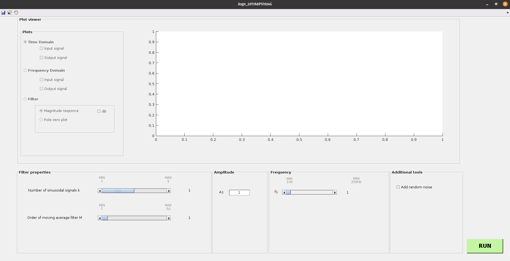

## MATLAB GUI to demonstrate the working of a Moving Average Filter

### Installation

1. Download the MovingAverageFilterToolbox from [here](https://www.mathworks.com/matlabcentral/fileexchange/99349-movingaveragefiltertoolbox).
2. Open MATLAB and navigate to the directory where you downloaded the toolbox. Double click the toolbox in MATLAB's file explorer to install.
3. In MATLAB, go to Add-Ons -> Manage Add-Ons. Find the toolbox that you just installed, right click, and select 'Open Folder'

### Gui Overview

### Choosing Input Parameters

1. Max value of k = 5
2. Max value of M = 50
3. Default value of k = 1
4. Default value of M = 1
5. Default value of Amplitude = 1
6. Default value of Frequency = 1
   
Notes

- The program will not throw an error if the user clicks on RUN without entering any values since every user input parameter has a default.
- The number of fields for entering values of amplitude and frequency varies based on the value of k.
- The user has an option to add random noise to the input signal

### Selecting Output Plots

1. Plots can be selected only after clicking the RUN button.
2. Input and output signals can be plotted on the same window for comparison.
3. The plot can be saved as a jpeg image using the save functionality.

### Additional notes

You can find screenshots of working in the /Screenshots directory

